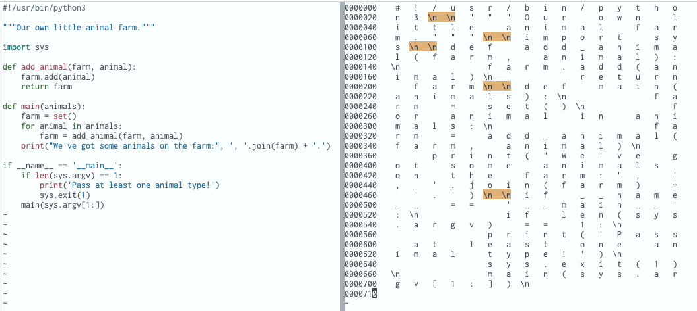

## Paragraph

## TL:DR:

To navigate to the next or previous paragraph you use`}`and `{`. 

In Vim, the definition of paragraph delimiter is a sequence of two newline characters  (`\n\n`).   


## More:

To navigate to the next or previous paragraph delimiter you use  `}` or `{`.  

In Vim, the definition of paragraph delimiter is a sequence of two newline characters  (`\n\n`).   

To inspect a sequence of two newline characters, you can use the octal dump command on your work file. For example, say you have a file called `animal_farm.py`:

```
$ od -c animal_farm.py > animal_farm.oct.txt
```

Using Vim to search for a sequence of two newline characters' pattern in the generated file  `animal_farm.oct.txt`  you type:

```
/\\n \\n
```

To make the pattern visible you set the following options:

```
:set hlsearch
```




