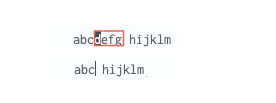
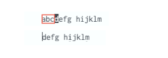

### Inconsistent behavior of change compound command:

Change-to-end-of-word, `ce`, will remove the character under the cursor:

Note that in the above, the character under cursor `d` was removed.

Change-to-beginning-of-word, `cb`, will not remove the character under the cursor:

Note that in the above, the character under cursor `d` was NOT removed.

