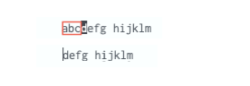

### Change compound command inconsistance:

The change-to-end-of-word command, `ce`, will remove the character under the cursor:

Note that in the above, the character under cursor, `d` ,was removed.

The change-to-beginning-of-word commmand, `cb`, will NOT remove the character under the cursor:

Note that in the above, the character under cursor, `d`, was NOT removed.

